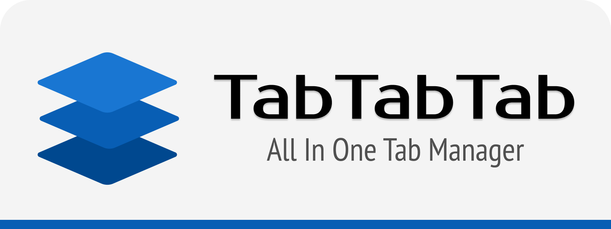
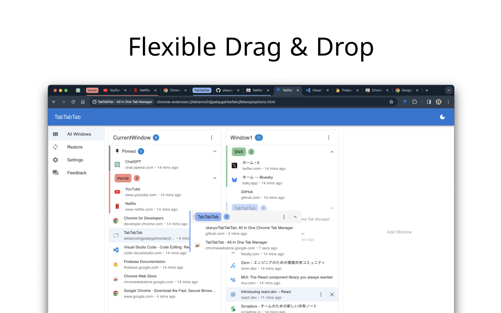
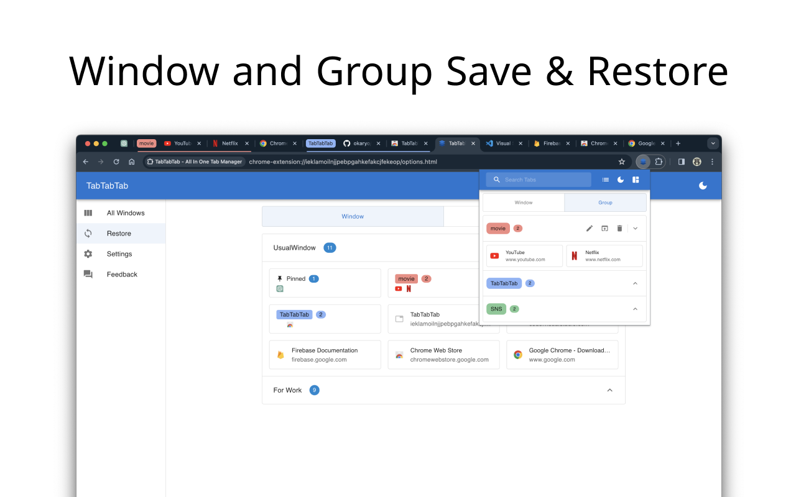
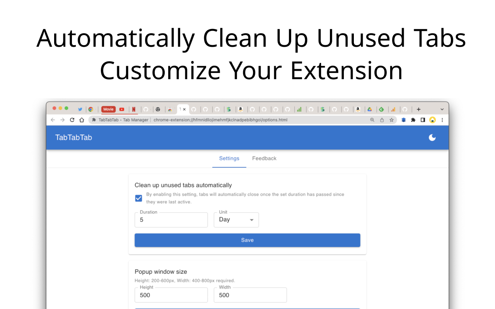

    

[![CI][ci-badge]][ci-url]
[![ChromeWebStore][chrome-web-store-badge]][chrome-web-store-url]
[![ChromeWebStoreUsers][chrome-web-store-users-badge]][chrome-web-store-url]

[ci-badge]: https://github.com/okaryo/TabTabTab/actions/workflows/test-and-lint.yml/badge.svg
[ci-url]: https://github.com/okaryo/TabTabTab/actions/workflows/test-and-lint.yml
[chrome-web-store-badge]: https://img.shields.io/chrome-web-store/v/hfmnidllojimehmfjkclnadpebibhgoi
[chrome-web-store-url]: https://chrome.google.com/webstore/detail/tabtabtab-tab-manager/hfmnidllojimehmfjkclnadpebibhgoi
[chrome-web-store-users-badge]: https://img.shields.io/chrome-web-store/users/hfmnidllojimehmfjkclnadpebibhgoi

TabTabTab is a Chrome extension that supports your browsing by improving tab management.

### 🌟 Key Features

* Comprehensive Tab Overview: View all your windows and tabs, including those grouped, in one unified list.
* Flexible Drag & Drop: Organize your tabs freely - be it pinned, grouped, or standalone.

### ✨ Additional Features

* Duplicate Tab Alert: Avoid clutter with automated alerts for duplicate tabs.
* Time Tracking: Keep track of how long it's been since you last accessed a tab.
Essential Tab Operations: Bookmarking, URL copying, pinning, and more.
* Screenshot Tool: Quickly capture the active tab's visible area.
* Efficient Navigation & Search: Jump to or find your desired tabs in seconds.
* Automatic Cleanup: Auto-remove tabs you haven't accessed based on your preferences.
* Dark Mode: Switch to a darker, more focused look whenever you wish.

### 👀 ScreenShots

